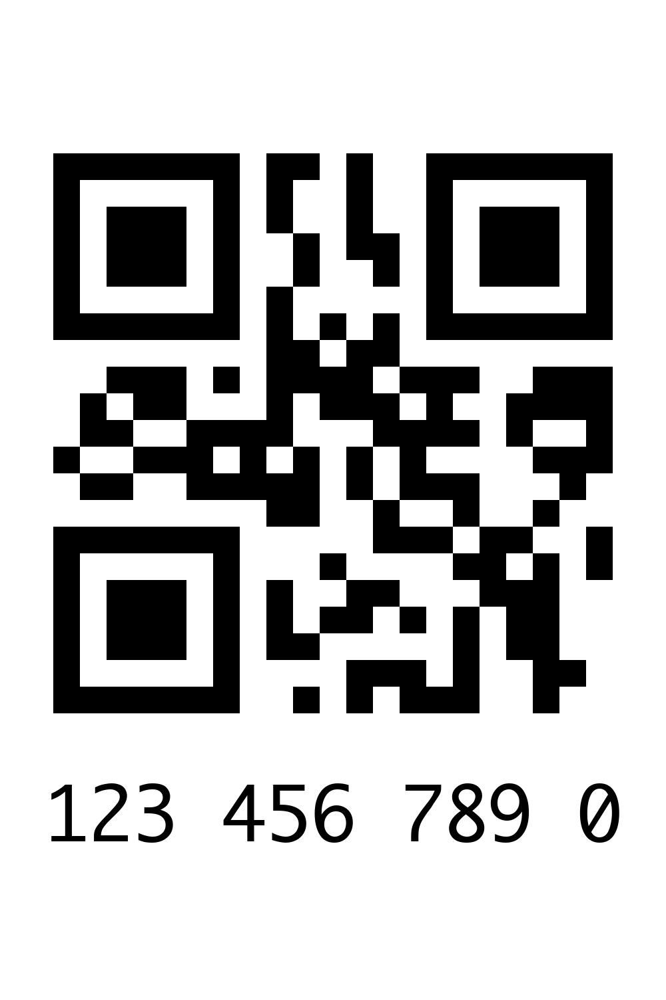

# InPostReturnLabel

Very simple web-app to generate courier-sized labels with QR code for InPost returns (10-digit codes, usually from Allegro).

*Obviously, this is not affiliated with neither InPost nor Allegro and only exists because I'm too lazy to write codes down by hand and to get my phone to open parcel locker from the app*.

The concept is to input 10-digit code and program sends QR and code itself to label printer loaded with courier-sized labels (approx 100x150mm).

It works in one of 3 modes:

1. just generate PNG image and open it using system preview
2. *legacy* print using `lpr` on UNIX system to printer by name
3. print over IPP to any printer which supports AirPrint (and URF); optionally, it can check and enforce media type loaded (useful when different rolls can be installed since single label size is supported now)

Operation mode and printer targets (as well as IPP parameters) can be set via CLI or config file (set via `--cfg` or default in `~/.config/InPostReturnLabel/config.yaml`). See example in [example/config.yaml](./example/config.yaml)

## Current limitations

- For CUPS printing, CLI assumes there's `lpr` binary on UNIX system. This should be handled better.
- For IPP printing, it's assumed that printer supports `image/urf`, which is very likely on AirPrint printer - but not guaranteed. It'd be better to support both URF and PWG and actually check what printer can support.
- Label template relies on *Incosolata Bold* font, which is bundled (SIL Open Font). It can be changed by user, but it must be TTF file and glyphs must have the same proportions as Incosolata, as template have sizing hardcoded.
- There's a single label template with hardcoded size.

## What's there - work in progress

### CLI

Simple CLI to send to local/network printer or open file if no printer is provided. Ability to load config file, CLI flags override file.

#### Installation

[](https://pypi.org/project/InPostReturnLabel/)

```bash
pipx install InPostReturnLabel
```

#### Usage

Help:

```
Usage: InPostReturnLabel [OPTIONS] COMMAND [ARGS]...

  InPostReturnLabel init.

Options:
  --version        Show the version and exit.
  --cfg FILE       Path to configuration file.  [default:
                   ~/.config/InPostReturnLabel/config.yaml]
  -v, --verbosity  Increase output verbosity (can be used multiple times).
  -h, --help       Show this message and exit.

Commands:
  print  Locally generate and print InPost return label from CODE


Usage: InPostReturnLabel print [OPTIONS] CODE

  Locally generate and print InPost return label from CODE

Options:
  -p, --printer TEXT      Local CUPS printer name; if ommited, then file will
                          be opened
  -i, --ipp-printer TEXT  IPP URL for printer; if ommited, then file will be
                          opened
  -m, --check-media TEXT  Enforce loaded media type for IPP printer
  --dpi INTEGER           DPI for IPP printer (likely 203 or 300)
  -f, --font TEXT         Path to font file, default: XXX
  -h, --help              Show this message and exit.
```

Example with legacy (CUPS) mode:

```
❯ InPostReturnLabel print -f /System/Library/Fonts/Monaco.ttf -p intermec 1234567890
Configuration loaded from /Users/daniel/.config/InPostReturnLabel/config.yaml
Using mode: cups
Label generated and stored at /var/folders/y0/xhrlswfd40gbzh5m50cbp1fxr3p32g/T/tmp6h4ksy4v.png
Sending label to intermec
```

Example with IPP mode:

```
❯ InPostReturnLabel print -i ipp://192.168.1.2:631/ipp/print -m om_brother-label-103x164mm_103x164mm 1234567890
Configuration loaded from /Users/daniel/.config/InPostReturnLabel/config.yaml
Using mode: ipp
Label generated and stored at /var/folders/y0/xhrlswfd40gbzh5m50cbp1fxr3p32g/T/tmpiwvduszj.png
Sending label to ipp://192.168.1.2:631/ipp/print
Printer has currently loaded media: om_brother-label-103x164mm_103x164mm
Printer response for job print request:
{'version': (2, 0), 'status-code': 0, 'request-id': 98020, 'operation-attributes': {'attributes-charset': 'utf-8', 'attributes-natural-language': 'en-US'}, 'unsupported-attributes': [], 'jobs': [{'job-uri': 'ipp://192.168.1.2:631/ipp/print/job-19', 'job-id': 19, 'job-state': <IppJobState.PROCESSING: 5>, 'job-state-reasons': 'job-incoming'}], 'printers': [], 'data': b''}
Printer status after printing:
{'version': (2, 0), 'status-code': 0, 'request-id': 52544, 'operation-attributes': {'attributes-charset': 'utf-8', 'attributes-natural-language': 'en-US'}, 'unsupported-attributes': [], 'jobs': [], 'printers': [{'printer-state': <IppPrinterState.PROCESSING: 4>, 'printer-state-reasons': 'spool-area-full-report', 'queued-job-count': 1}], 'data': b''}
```

### Simple web-app - TBD

The goal is to load it on home Docker/k8s and start printing over network.

## Technical background

InPost parcel lockers accept returns by entering 10-digit code - either from keypad on device or by scanning QR code. The only tricky bit here is that parcel lockers can only read *numeric mode* and most common QR generators insist on generating them in alphanumeric mode, even when only digits 0-9 are provided.

## Example label



---

## Acknowledgement of 3rd party work

### `imageurf` by DkDavid

`imageurf` by DkDavid - https://github.com/DkDavid/imageurf was taken and converted from JavaScript to Python. It is stored under [`src/InPostReturnLabel/urf.py`](./src/InPostReturnLabel/urf.py).

```
MIT License

Copyright (c) 2017 David Dillkötter

Permission is hereby granted, free of charge, to any person obtaining a copy
of this software and associated documentation files (the "Software"), to deal
in the Software without restriction, including without limitation the rights
to use, copy, modify, merge, publish, distribute, sublicense, and/or sell
copies of the Software, and to permit persons to whom the Software is
furnished to do so, subject to the following conditions:

The above copyright notice and this permission notice shall be included in all
copies or substantial portions of the Software.

THE SOFTWARE IS PROVIDED "AS IS", WITHOUT WARRANTY OF ANY KIND, EXPRESS OR
IMPLIED, INCLUDING BUT NOT LIMITED TO THE WARRANTIES OF MERCHANTABILITY,
FITNESS FOR A PARTICULAR PURPOSE AND NONINFRINGEMENT. IN NO EVENT SHALL THE
AUTHORS OR COPYRIGHT HOLDERS BE LIABLE FOR ANY CLAIM, DAMAGES OR OTHER
LIABILITY, WHETHER IN AN ACTION OF CONTRACT, TORT OR OTHERWISE, ARISING FROM,
OUT OF OR IN CONNECTION WITH THE SOFTWARE OR THE USE OR OTHER DEALINGS IN THE
SOFTWARE.
```

### Inconsolata font

Bundled font (`Inconsolata-Bold.ttf`) is licensed under SIL Open Font License.

```
This Font Software is licensed under the SIL Open Font License, Version 1.1.
This license is copied below, and is also available with a FAQ at: http://scripts.sil.org/OFL

—————————————————————————————-
SIL OPEN FONT LICENSE Version 1.1 - 26 February 2007
—————————————————————————————-

PREAMBLE
The goals of the Open Font License (OFL) are to stimulate worldwide development of collaborative font projects, to support the font creation efforts of academic and linguistic communities, and to provide a free and open framework in which fonts may be shared and improved in partnership with others.

The OFL allows the licensed fonts to be used, studied, modified and redistributed freely as long as they are not sold by themselves. The fonts, including any derivative works, can be bundled, embedded, redistributed and/or sold with any software provided that any reserved names are not used by derivative works. The fonts and derivatives, however, cannot be released under any other type of license. The requirement for fonts to remain under this license does not apply to any document created using the fonts or their derivatives.

DEFINITIONS
“Font Software” refers to the set of files released by the Copyright Holder(s) under this license and clearly marked as such. This may include source files, build scripts and documentation.

“Reserved Font Name” refers to any names specified as such after the copyright statement(s).

“Original Version” refers to the collection of Font Software components as distributed by the Copyright Holder(s).

“Modified Version” refers to any derivative made by adding to, deleting, or substituting—in part or in whole—any of the components of the Original Version, by changing formats or by porting the Font Software to a new environment.

“Author” refers to any designer, engineer, programmer, technical writer or other person who contributed to the Font Software.

PERMISSION & CONDITIONS
Permission is hereby granted, free of charge, to any person obtaining a copy of the Font Software, to use, study, copy, merge, embed, modify, redistribute, and sell modified and unmodified copies of the Font Software, subject to the following conditions:

1) Neither the Font Software nor any of its individual components, in Original or Modified Versions, may be sold by itself.

2) Original or Modified Versions of the Font Software may be bundled, redistributed and/or sold with any software, provided that each copy contains the above copyright notice and this license. These can be included either as stand-alone text files, human-readable headers or in the appropriate machine-readable metadata fields within text or binary files as long as those fields can be easily viewed by the user.

3) No Modified Version of the Font Software may use the Reserved Font Name(s) unless explicit written permission is granted by the corresponding Copyright Holder. This restriction only applies to the primary font name as presented to the users.

4) The name(s) of the Copyright Holder(s) or the Author(s) of the Font Software shall not be used to promote, endorse or advertise any Modified Version, except to acknowledge the contribution(s) of the Copyright Holder(s) and the Author(s) or with their explicit written permission.

5) The Font Software, modified or unmodified, in part or in whole, must be distributed entirely under this license, and must not be distributed under any other license. The requirement for fonts to remain under this license does not apply to any document created using the Font Software.

TERMINATION
This license becomes null and void if any of the above conditions are not met.

DISCLAIMER
THE FONT SOFTWARE IS PROVIDED “AS IS”, WITHOUT WARRANTY OF ANY KIND, EXPRESS OR IMPLIED, INCLUDING BUT NOT LIMITED TO ANY WARRANTIES OF MERCHANTABILITY, FITNESS FOR A PARTICULAR PURPOSE AND NONINFRINGEMENT OF COPYRIGHT, PATENT, TRADEMARK, OR OTHER RIGHT. IN NO EVENT SHALL THE COPYRIGHT HOLDER BE LIABLE FOR ANY CLAIM, DAMAGES OR OTHER LIABILITY, INCLUDING ANY GENERAL, SPECIAL, INDIRECT, INCIDENTAL, OR CONSEQUENTIAL DAMAGES, WHETHER IN AN ACTION OF CONTRACT, TORT OR OTHERWISE, ARISING FROM, OUT OF THE USE OR INABILITY TO USE THE FONT SOFTWARE OR FROM OTHER DEALINGS IN THE FONT SOFTWARE.
```
